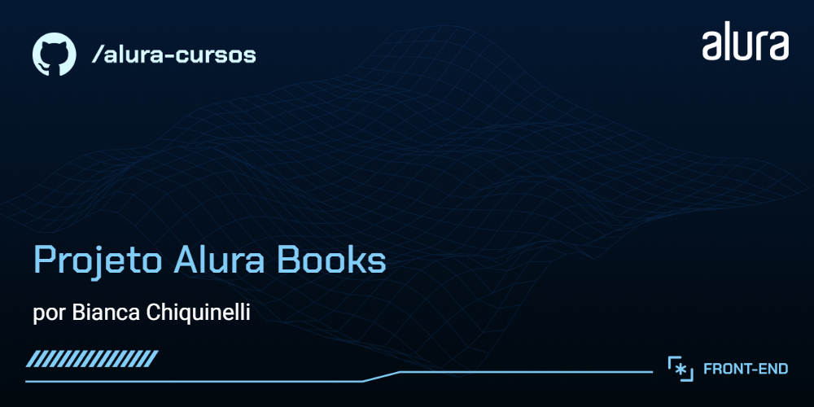

# Alura Books

Estrutura inicial do projeto criada a partir do curso "curso" da Alura

## 🔨 Funcionalidades do projeto

O Alura Books é um projeto desenvolvido no curso "HTML e CSS: responsividade com mobile-first" da Alura é um site fictício da AluraBooks, uma loja virtual especializada em livros técnicos de tecnologia. O objetivo do projeto é criar um site responsivo com layouts para dispositivos móveis, tablets e desktops. Durante o desenvolvimento, o foco é aplicar a metodologia mobile-first, utilizando media queries para garantir que a interface se ajuste corretamente a diferentes tamanhos de tela, sem funcionalidades de back-end ou integração com APIs.

## ✔️ Técnicas e tecnologias utilizadas

As técnicas e tecnologias utilizadas pra isso são:

- `HTML5:` Utilizado para estruturar o conteúdo da página, com ênfase na acessibilidade e semântica.

- `Flexbox:` Usado para criar layouts flexíveis e dinâmicos, permitindo um controle mais eficiente da disposição dos elementos.
- `Grid Layout:` Complementa o Flexbox, ideal para a criação de layouts mais complexos e com múltiplas colunas.
- `Media Queries:` Fundamentais para a criação de designs responsivos, ajustando o layout conforme o tamanho da tela.
- `BEM` (Block, Element, Modifier): Aplicado para nomeação de classes e organização do código, promovendo maior reutilização e manutenção.
- `CSS3:` Empregado para estilizar a página, com foco em responsividade e design moderno, Abaixo alguns tópicos abordados no curso:
  - _Pseudo-classes_ `:hover,` `:active,` `:focus,` 
  - _Positioning_ como `relative` e `absolute`
  - _Combinadores CSS_ 
  - _Unidades de Viewport_  como `vw,` `vh` `vmin,` `vmax`
  - _Transições e Animações:_ 
  - _Efeito de Gradiente no Texto_ como `Background Clip` e `Webkit`
  - _Background Clip (e Webkit_
  - _Pseudo-elementos_ como `::before,` `::after,` `::placeholder`

## 📁 Acesso ao projeto

Você pode [ acessar o Alura Books através deste link](https://alura-books-eight-blue.vercel.app/)
